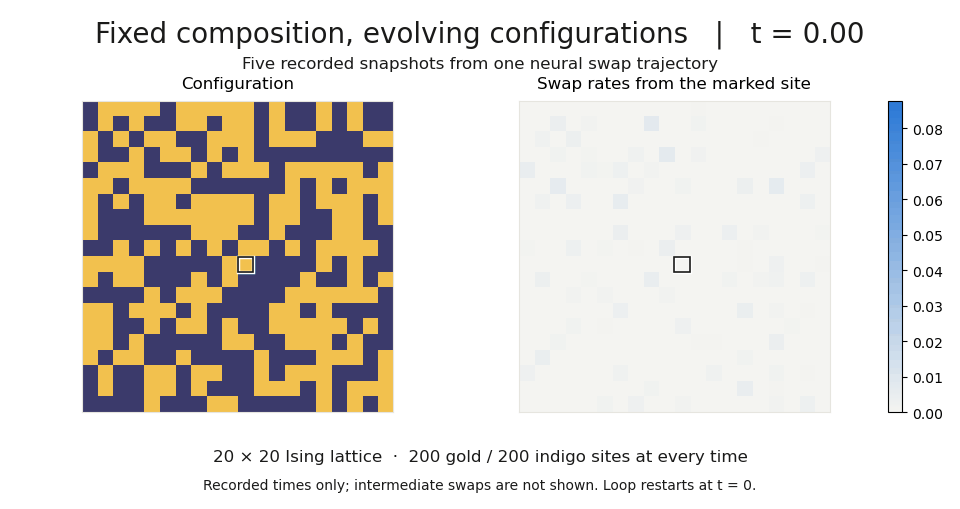
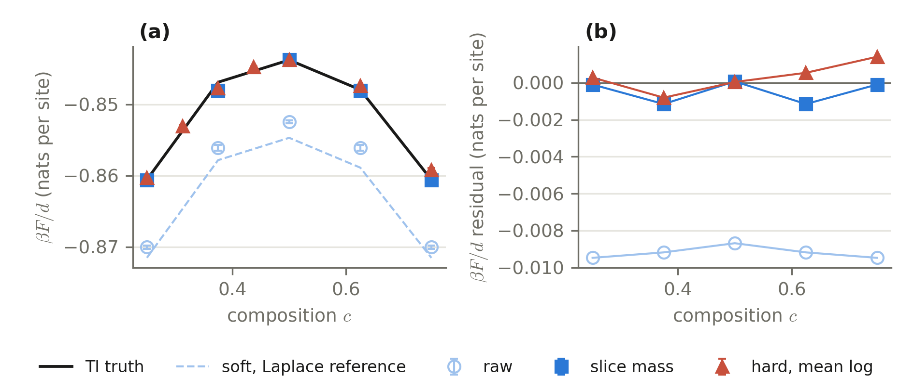

# Discrete Neural Samplers with Constraints

Code accompanying my MSc dissertation at Imperial College London on constrained
sampling of discrete materials configurations, supervised by Yingzhen Li,
Zijing Ou and Alex Ganose.

The project extends Discrete Neural Flow Samplers (DNFS) from unconstrained
Ising systems to composition penalties, exact composition through swap dynamics,
and Cu–Au cluster-expansion targets. A learned continuous-time Markov chain
transports a simple base distribution towards a Boltzmann target; importance
weights support target expectations and free-energy estimation.
Training minimises a squared Kolmogorov-forward residual, using a discrete Stein
control variate to estimate the log-normaliser derivative.



**Composition is fixed throughout the path:** all five recorded states contain
200 sites of each species. This is one raw proposal trajectory from the retained
EMA checkpoint, shown at five times; intermediate swaps are not stored here.
The rate panel uses a common scale across frames.
[Static figure and provenance](assets/readme/README.md).

## Explore the project

| Study | What it investigates |
| --- | --- |
| [Unconstrained baseline](experiments/dnfs_baseline_01/README.md) | Paper-derived Ising replication with locally equivariant rate models |
| [Soft constraints](experiments/constrained_soft_02/README.md) | Composition penalties, acceptance, amortisation and free-energy corrections |
| [Hard constraints](experiments/constrained_hard_03/README.md) | Count-preserving swap heads, Ising lattices through 24×24, and neural/classical comparisons |
| [Cu–Au application](experiments/alloy_ce/README.md) | Free, soft and fixed-composition sampling on 16-site and 64-site FCC cluster expansions |

The [experiment guide](experiments/README.md) explains entrypoints, saved runs
and figure reproduction. The [launcher index](slurm/README.md) groups the retained
cluster campaigns; [shared scripts](scripts/README.md) cover classical baselines
and comparisons across experiments.

## A result: free energy across compositions



At the critical 8×8 Ising cell, the retained figure compares soft estimates,
their slice-mass correction, and hard mean-log estimates against thermodynamic
integration. It uses Euler-grid extrapolation, three hard seeds and four soft
seeds. The hard branch uses EMA evaluations; the soft branch uses raw-checkpoint
evaluations. The image is copied unchanged from the dissertation.
[Input selections and reproduction limits](assets/readme/README.md#free-energy-comparison).

## Setup

The environment is managed with [Pixi](https://pixi.sh). From the repository root:

```bash
pixi install --locked -e dev
pixi run -e dev test
```

The committed `pixi.lock` covers `linux-64` and `osx-arm64`. CUDA runs use the
separate Linux `cuda` environment. Other project tasks are:

```bash
pixi run -e dev lint       # Ruff: src/, experiments/, tests/
pixi run -e dev format     # Format those directories (modifies files)
pixi run jupyter
```

To inspect the hard-training interface or render the committed snapshots:

```bash
pixi run -e dev python -m experiments.constrained_hard_03.run --help
pixi run -e dev python -m scripts.animate_recorded_swap --out /tmp/recorded_swap.gif
```

Training and evaluation examples are described in the [experiment guide](experiments/README.md).
The test suite covers analytic residuals, estimator checks, equivariance,
locality, exact composition and checkpoint/resume behaviour.

## Repository layout

```text
src/discrete_flow_sampler/
  targets/       Ising, Potts and cluster-expansion targets
  models/        Rate-model backbones and conditioning
  constraints/   Swap-readout heads and exact-field channels
  samplers/      Flip/swap CTMCs, residuals, training, SMC and neural baselines
  mcmc/          Gibbs, Wolff, Kawasaki and mchammer baselines
  diagnostics/   Metrics, FLOP accounting and figure style
experiments/     Configurations, trainers, analysis and experiment guides
scripts/         Shared baselines, comparisons and figure tools
slurm/           Historical cluster launchers and campaign index
assets/          Small retained figure inputs and README visuals
data/           Exported cluster expansions and reference database
icet-ce/         Cluster-expansion fitting and energy-prediction workflow
notebooks/       Familiarisation and cross-check notebooks
tests/           Correctness and regression checks
```

Production runs are stored locally under `results/` and are not tracked. A Git
checkout therefore supports code inspection, tests and the recorded animation;
most report analyses also require the original run archives and references.
Some historical checkpoints, samples and exact training revisions remain
unavailable. The guides preserve these distinctions and the withdrawn campaign
restrictions.

## Acknowledgements

This work builds on Discrete Neural Flow Samplers by Zijing Ou and collaborators.
The original code is at [J-zin/DNFS](https://github.com/J-zin/DNFS).
Implementation here is derived from the papers' equations and algorithmic
descriptions.

## License

A release licence has not yet been selected.

## Citation

If you find this work useful, please cite both of the below:

```bibtex
@thesis{
  crabb2026discrete,
  title={Discrete Neural Flow Samplers with Constraints for Materials Discovery},
  author={Mitchell Crabb},
  institution={Imperial College London},
  type={mathesis},
  year={2026},
  pubstate={inpreparation},
  editora={Yingzhen Li and Zijing Ou and Alex Ganose},
  editoratype={collaborator}
}

@inproceedings{
  ou2025discrete,
  title={Discrete Neural Flow Samplers with Locally Equivariant Transformer},
  author={Zijing Ou and Ruixiang ZHANG and Yingzhen Li},
  booktitle={The Thirty-ninth Annual Conference on Neural Information Processing Systems},
  year={2025},
  url={https://openreview.net/forum?id=Wk65okms3T}
}
```
