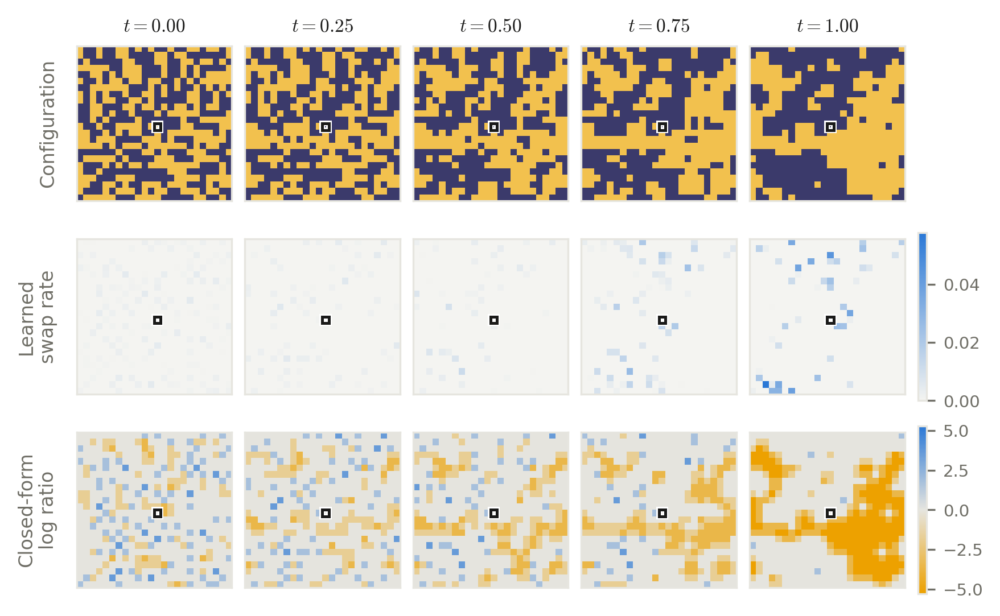
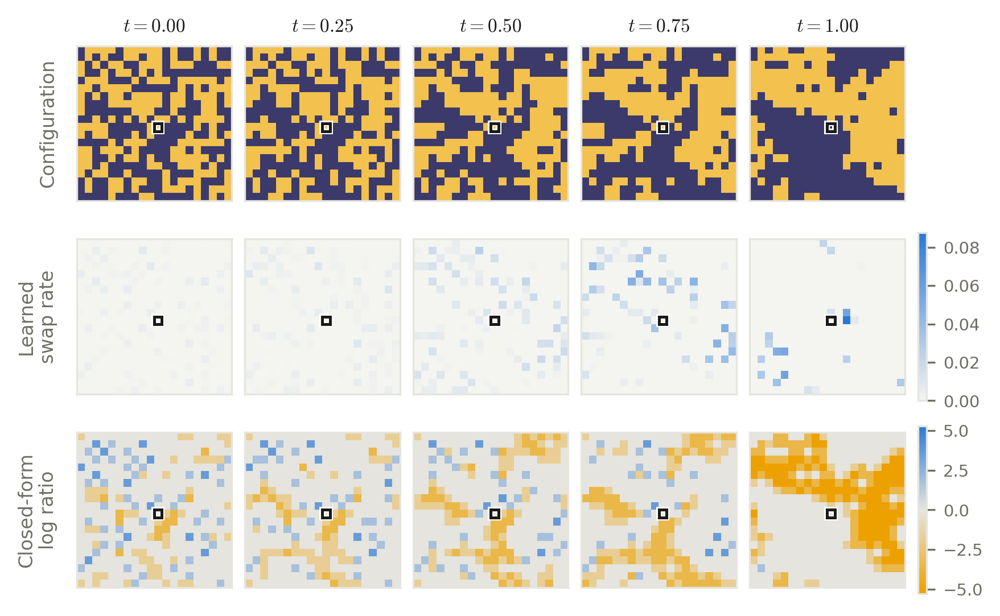

# README visuals and provenance

[Project overview](../../README.md)

## Recorded 24×24 swap trajectory

[Animation](recorded_swap.gif) · [Static strip](hard_rate_field_strip_24x24.png) ·
[Checkpoint bundle](../../checkpoints/README.md)



The animation renders all 129 integration-grid states and learned anchor rates
stored in [hard_rate_field_strip_24x24.npz](../hard_rate_field_strip_24x24.npz).
The static strip displays steps 0, 32, 64, 96 and 128 from that same trajectory.
This is a new README illustration, recorded from the bundled checkpoint on
7 September 2026; it is not a copied dissertation figure or a new evaluation result.

| Property | Recorded value |
| --- | --- |
| System | 24×24 periodic Ising lattice, composition 0.5; 288 sites of each species |
| Coupling | `sigma = 0.22034339675488573` |
| Run | `H2_d576_c50_s220_letf_thp3_100k_curr_b512_ne128_cv2_w5bf16_seed42_20260903-d576-sc` |
| Checkpoint | `final_ema.pt`, two-hole patch head, radius 3 |
| Checkpoint SHA-256 | `ace63eba799f714a8c39281a0b5798d60906ef228c55d879061be5df331e08da` |
| Rollout | Seed `20260907`, one raw draw; no selection or resampling |
| Integration | 128 matching intervals, fp32, CPU, one thread; PyTorch version stored in archive |
| Stored states | Steps 0–128 inclusive; times 0–1 |
| Marked anchor | Site 300, zero-based row/column (12, 12) |
| Playback | 80 ms per grid frame, 2.4 s at the terminal state, then restart |

Frames are recorded grid states with no interpolation. A matching step can
contain several disjoint swaps; playback is not a physical timescale. The
terminal state is a proposal draw, not an importance-resampled target draw.
The rate panel uses the upper-triangle pair convention and a common scale
across all frames. The static strip's third row is the signed terminal-target
log ratio, not a transition rate or the time-dependent path ratio.

Render both visuals from the committed recording:

```bash
pixi run -e dev python -m scripts.animate_recorded_swap --out /tmp/recorded_swap.gif
pixi run -e dev python -m experiments.constrained_hard_03.analysis.rate_field_strip \
  --recorded assets/hard_rate_field_strip_24x24.npz --recorded-stride 32 \
  --out /tmp/recorded_swap.png
```

To record the trajectory again, follow the
[checkpoint guide](../../checkpoints/README.md#recreate-the-readme-animation).
The recorder saves the checkpoint/config hashes, seed, batch size (one),
precision, thread count and PyTorch version with the arrays.

## Historical 20×20 report trajectory

[Static report figure](hard_rate_field_strip_20x20.png)



The earlier README animation used the five states and learned rates stored in
[hard_rate_field_strip_20x20.npz](../hard_rate_field_strip_20x20.npz). No model is
loaded and no intermediate states are invented. With this five-frame input, the renderer holds each stored time
for 1.2 seconds and the terminal state for 2.4 seconds; its loop then restarts at
the initial state. Playback duration is illustrative, not a physical timescale.
The static PNG is copied unchanged from the report at revision `a644a34`.

| Property | Recorded value |
| --- | --- |
| System | 20×20 periodic Ising lattice, composition 0.5; 200 sites of each species |
| Coupling | `sigma = 0.22034339675488573` |
| Run | `H2_d400_c50_s220_letf_thp3_100k_curr_b512_ne128_cv2_w4_seed42_20260829-d400-sc` under `results/03_hard/` |
| Checkpoint | `final_ema.pt` |
| Checkpoint SHA-256 recorded in archive | `0dcd4a2a3dcba42c9085e96d35a15afa9669939744ab0dfc241d28272f72db4b` |
| Original rollout | Seed `20260905`, six raw draws, displayed draw index 0; no selection or resampling |
| Integration | 128 matching steps, fp32, CPU |
| Stored frames | Steps 0, 32, 64, 96, 128; times 0, 0.25, 0.5, 0.75, 1 |
| Marked anchor | Site 210, zero-based row/column (10, 10) |

These states follow the learned proposal process. The terminal state is not an
importance-resampled target draw. The rate panel shows one-way rates for swaps
between the anchor and each partner, using the upper-triangle pair convention
and a fixed scale across time. The static figure's third row is a signed
terminal-target log-ratio channel; it is not a transition rate or the time-t
path ratio.

Render the animation or static strip from the committed archive:

```bash
pixi run -e dev python -m scripts.animate_recorded_swap \
  --recorded assets/hard_rate_field_strip_20x20.npz --out /tmp/recorded_swap_20x20.gif
pixi run -e dev python -m experiments.constrained_hard_03.analysis.rate_field_strip \
  --recorded assets/hard_rate_field_strip_20x20.npz --out /tmp/recorded_swap.pdf
```

The archive carries the original rollout metadata. The animation renderer is
[animate_recorded_swap.py](../../scripts/animate_recorded_swap.py); the static
renderer is [rate_field_strip.py](../../experiments/constrained_hard_03/analysis/rate_field_strip.py).
The latter's live-checkpoint mode has a different draw contract and does not
recreate the archived rollout merely by matching its seed.

## Free-energy comparison

[fc_hard_direct_8x8_sc.png](fc_hard_direct_8x8_sc.png) is an unchanged copy of the
report asset at revision `a644a34`. Its SHA-256 is
`784fa081c32957a631a39ed365def02b0108a765668f8f4421f94b2faf7ba324`.
The [machine-readable manifest](fc_comparison_manifest.json) records the report
revision, selected hard files and an equivalent command using the current
[fc_compare.py](../../experiments/constrained_soft_02/analysis/fc_compare.py) name.
That command requires local archives and was not executed for this README.

The figure compares dimensionless free energy per site on the 8×8 Ising lattice
at the exact critical coupling. Its left panel shows estimates and its right
panel subtracts the thermodynamic-integration reference. The soft raw estimate,
soft slice-mass correction and hard mean-log estimate are separate quantities;
the soft Laplace reference is also shown.

- Hard: corrected-tagged `20260905-camort-d64-perslice` probes, seeds 42–44,
  EMA checkpoints, 128/256 grid points and Richardson extrapolation.
- Soft: composition-0.25/0.375/0.5 specialist configurations, seeds 42–45,
  raw checkpoints, 256/512 grid points and slice-mass correction with Richardson
  extrapolation. Reflected 0.625/0.75 points reuse 0.375/0.25 draws.
- Reference: `results/02_constrained_soft/fc_ref_d8_sc.npz`. The selector uses
  an ESS fraction floor of 0.30 (all 12 soft runs pass), 2000 bootstrap replicates
  and NumPy RNG seed 0.

Here grid points mean 127/255 hard intervals and 255/511 soft intervals. The
caption's three hard and four soft seeds refer to each composition's selected
inputs. Reference forward–reverse differences are numerical hysteresis
diagnostics, not confidence intervals. The recovered figure selection does not
establish the historical trainer revision: corrected-tagged d64 checkpoints and
exact training revision remain unverified locally.

The older [hard_fc_curve_args.json](../hard_fc_curve_args.json) selects pooled
predecessors and is retained as historical evidence. It is not the command for
this image.
